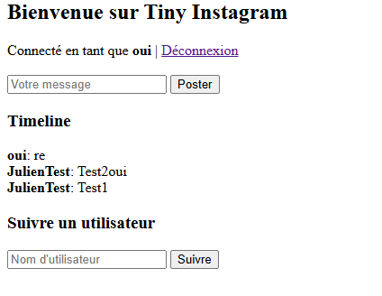
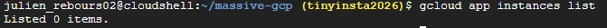
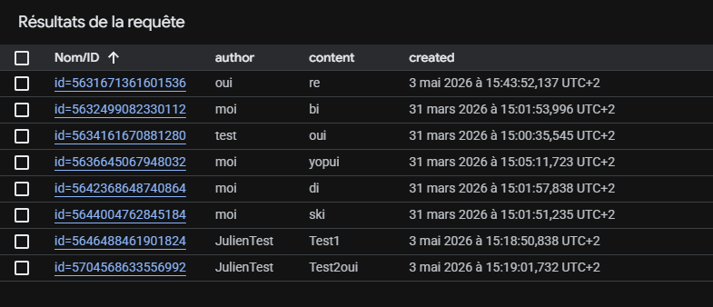
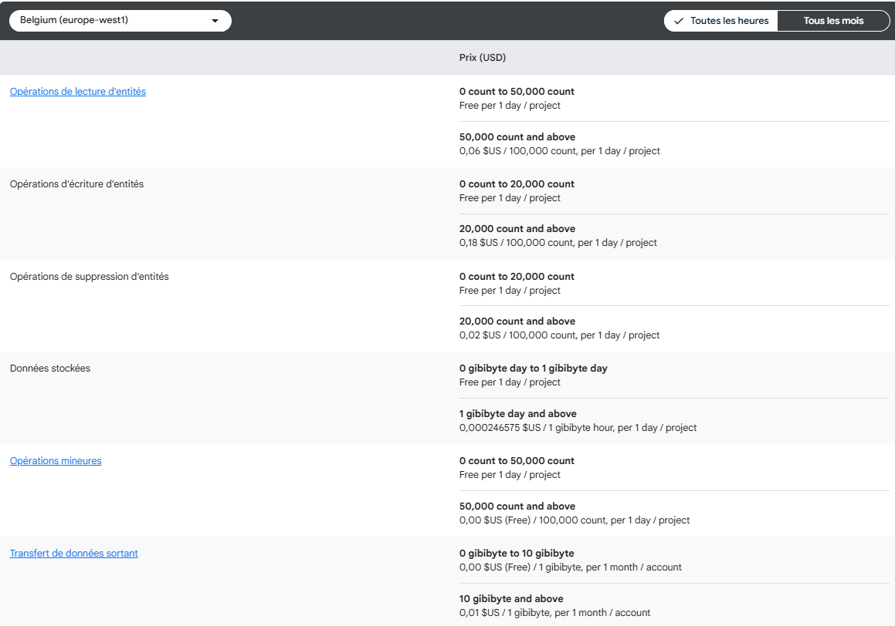
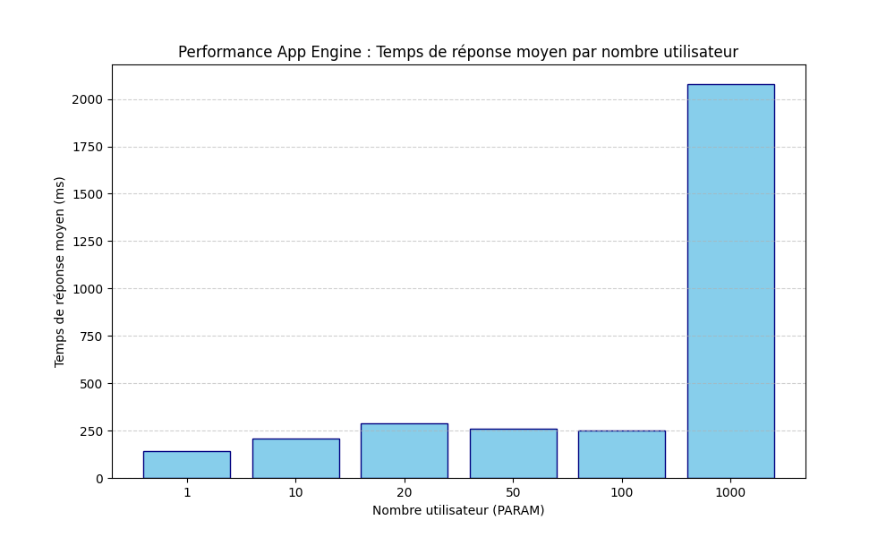
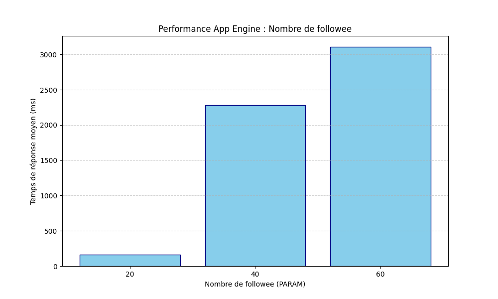

# Tiny Instagram (minimal) on Google App Engine

This repository contains a tiny Instagram-like demo implemented with Flask and Google Cloud Datastore (Firestore in Datastore mode). It is a small, educational project that demonstrates posting, following, and reading a simple timeline.

This README describes how to run, seed and test the app, plus notes about GQL queries and common deployment troubleshooting.

## Prerequisites
- Create a GCP Project:`https://console.cloud.google.com/`
  - See the prof.

- Open a cloud shell 
  - see the prof.

* Initialize or select your GCP project and create the App Engine application (if not already created):

```sh
gcloud init
gcloud app create
```

- clone the prof github repository : 
```
git clone https://github.com/momo54/massive-gcp
cd massive-gcp
```

* Install dependencies
```sh
pip install -r requirements.txt
```

* Deploy the app:

```sh
gcloud app deploy
```

* [OPTIONAL] Index does not matter:

```sh
gcloud app deploy index.yaml
# or
gcloud datastore indexes create index.yaml
```

* open the URL address of the you application, create account, post, follow. Does it Works?? If something is wrong where to find the error ?? 
  * See the prof
ça fonctionne, je peux créer des comptes, faire des post et follow d'autres comtpes, et si jamais quelques choes se passent mal je peux aller vérifier dans Log Explorer.


* How many servers are working for this app?? How much are you paying for running this app ? What is the cloud model for this app (Iaas, Paas, Saas). What is the Platform in PaaS ??

On utilise des instances pour l'application, et le nombre est dynamique on peut en avoir 0 ou plus, à l'instant où j'écris cette ligne, nous utilisons 0 instances.

App engine Standard propose environ 28h d'instances F1 gratuit par jour et donc pour l'instant, l'état de facturation est de 0 "Cette application n'a utilisé aucune ressource facturable aujourd'hui."
Le cloud model pour cette app est le Paas, car on gère seulement le code et sa configuration, de son côté la plateforme s'occupe de l’OS, les VM, le patching, l’orchestration et l’auto‑scaling bas niveau.

* See the impact in the datastore: do you see your data ?
  * See the prof
Oui on peut voir les requêtes dans le Datastore


* How much are you paying for hosting these data in this store ?? 
On voit que le coût de stockage est d'environ 0,000246575 $US / 1 gibibyte l'heure, pour 1 jour / projet
Le plus cher sont les opérations comme l'écriture ou la lecture qui coûtent respectivement 0.06 et 0.18 dollars tout les 100 000 ecritures/lectures.

* What is the consistency of this store ?
Strong consistency pour les accès par clés et les "ancestor queries".
Eventual consistency pour les requêtes globales.
* What is the sharding strategy of this store ? How to be sure of that ? 
Le sharding strategy est un range partitionning avec des divisions dynamiques.
Datastore limite les écritures sur une seule entité (ou groupe d'entités) à environ 1 écriture par seconde. Si vous essayez de mettre à jour un compteur unique très rapidement, vous recevrez des erreurs de contention. C'est pourquoi on utilise des "Sharded Counters" pour répartir la charge sur plusieurs entités.
* What queries can you write with store (expressivity)
Possibilités : Filtres d'égalité (=), d'inégalité (<, >, !=), et l'opérateur IN.
Limitations : Pas de JOINs, pas de sous-requêtes, et pas d'agrégations complexes (comme SUM ou GROUP BY) côté serveur. Pour compter, il faut soit scanner toutes les entités (coûteux), soit maintenir un compteur manuel.

## HTTP Endpoints

- `/` — HTML UI for simple interactions
- `POST /login` — login with a username (no password)
- `POST /post` — create a new post (form)
- `POST /follow` — follow another user (form)
- `GET /api/timeline?user=<username>&limit=<n>` — JSON timeline for a user (default limit 20)
- `POST /admin/seed` — server-side seed (requires `SEED_TOKEN` via header `X-Seed-Token` or `token` param)

Example server-side seed call:

```sh
curl -X POST \
  -H "X-Seed-Token: change-me-seed-token" \
  "https://<YOUR_APP>.appspot.com/admin/seed?users=8&posts=100&follows_min=1&follows_max=4&prefix=load"
```

## Access the backend from the CLI

The JSON endpoint `GET /api/timeline?user=<username>&limit=20` is suitable for basic load experiments.

- Run locally against the dev server:

```sh
ab -n 200 -c 20 "http://127.0.0.1:8080/api/timeline?user=demo1&limit=20"
```

- Run against the deployed app (no cookie):

```sh
ab -n 500 -c 50 "https://<YOUR_APP>.appspot.com/api/timeline?user=demo1&limit=20"
```

- Optional: include a session cookie if you want to test authenticated flows (get `session` cookie from your browser devtools):

```sh
AB_COOKIE="session=<VALUE>"
ab -n 500 -c 50 -H "Cookie: $AB_COOKIE" "https://<YOUR_APP>.appspot.com/api/timeline?limit=20"
```

Interpreting common metrics:
- `Requests per second` — throughput
- `Time per request` — latency
- `Failed requests` — should remain near 0 for a healthy run

## GQL & Datastore notes

The timeline query used by the app is roughly:

```sql
SELECT * FROM Post WHERE author IN @authors ORDER BY created DESC
```

Notes:
- `IN` queries are conceptually implemented as a union of per-author scans followed by a k-way merge ordered by `created DESC`.
- The repository includes `index.yaml` with a composite index (author + created desc), which is required for efficient execution of the timeline query.
- Writes use the Datastore entity API; GQL is used for convenient reads only.

Limitations and trade-offs:
- `IN` with many values increases work and latency because it becomes multiple queries merged server-side.
- Global queries are eventually consistent; only key lookups and ancestor queries are strongly consistent. See `NOTES.md` for more detail.

## Troubleshooting: Cloud Build / staging bucket error

If you encounter an error like:

```
Failed to create cloud build: ... invalid bucket "staging.<PROJECT>.appspot.com"; service account ... does not have access
```

Check the following:

1. Required services are enabled:

```sh
gcloud services enable appengine.googleapis.com cloudbuild.googleapis.com iam.googleapis.com storage.googleapis.com
```

2. Ensure the App Engine service account has sufficient permissions on the staging bucket. For example, grant storage admin at project level (adjust to least privilege required):

```sh
PROJECT_ID="<YOUR_PROJECT>"
gcloud projects add-iam-policy-binding "$PROJECT_ID" \
  --member="serviceAccount:${PROJECT_ID}@appspot.gserviceaccount.com" \
  --role="roles/storage.admin"
```

3. If the staging bucket is missing, create it and grant the service account object admin on the bucket:

```sh
gsutil mb -p "$PROJECT_ID" -l europe-west1 "gs://staging.${PROJECT_ID}.appspot.com"
gsutil iam ch serviceAccount:${PROJECT_ID}@appspot.gserviceaccount.com:objectAdmin "gs://staging.${PROJECT_ID}.appspot.com"
```

Index deployment (if GCP prompts for missing indexes):

```sh
gcloud datastore indexes create index.yaml || gcloud app deploy index.yaml
```

## Notes on consistency, partitioning and CAP
See `NOTES.md` for a concise explanation of Datastore's partitioning (range partitioning with dynamic splits), replication, and its consistency model (generally AP for global queries; strong consistency for key lookups and ancestor queries).

## License
MIT

```

Passage à l’échelle sur la charge

Pour étudier l’évolution de performance en présence de concurrence, vous devez fixer la taille des données: 1000 utilisateurs, 50 posts par utilisateur et 20 followers random par utilisateur.
Il faut ensuite mesurer le temps d'exécution moyen d'une requête timeline (ms) pour les configurations suivantes: 1, 10, 20,50,100, 1000 utilisateurs distincts simultanés.
Toute mesure de temps doit être répétée 3 fois.

Voici les résultats:



L'observation : Le temps de réponse reste stable entre 1 et 100 utilisateurs. Par contre, à 1000 utilisateurs, le temps de réponse explose au-delà de 2000ms.
Est-ce logique ? Oui. C'est le comportement typique d'un service PaaS comme App Engine.
Entre 1 et 100 : L'autoscaler fait son travail. Quand la charge monte, App Engine déploie de nouvelles instances. Si on a plus d'instances pour traiter 100 utilisateurs que pour 20, la charge par instance est mieux répartie, ce qui explique la stabilisation du temps de réponse.
À 1000 : On a probablement atteint une limite : soit le max_instances disponible (pas le cas ici), soit la vitesse à laquelle l'autoscaler peut provisionner de nouvelles instances (pression sur le CPU avant que l'instance suivante ne soit prête), soit une saturation au niveau des connexions à la base de données.
Est-ce que ça scale ? Oui. Horizontalement, l'infrastructure encaisse l'augmentation du nombre d'utilisateurs tant que les ressources de calcul peuvent être provisionnées.

Passage à l’échelle sur taille des données

1000 user,  le nombre de posts par utilisateur à 100 et le nombre d’utilisateurs simultané distinct à 50.  Faire varier les nombre de followee  (Abonné) : 20,40,60

Voici les résultats:



L'observation : Ici, c'est radical. À 20 abonnés (followees), tout va bien (~150ms). Dès qu'on passe à 40, le temps de réponse saute à 2300ms, puis dépasse les 3000ms à 60.
Est-ce logique ? Oui, mais c'est un problème connue. C'est ce qu'on appelle le problème du Fan-out on Read.
Notre requête GQL utilise un IN sur la liste des auteurs : SELECT * FROM Post WHERE author IN @authors ORDER BY created DESC.
Dans Google Datastore, une requête IN n'est pas une requête magique unique. En interne, la base de données doit exécuter autant de sous-requêtes qu'il y a d'auteurs dans la liste, puis effectuer un "merge-sort" côté serveur pour renvoyer le résultat global.
Plus vous suivez de personnes (20 -> 40 -> 60), plus vous multipliez le travail de Datastore pour une seule timeline. C'est un coût de lecture qui augmente de manière linéaire (ou pire) avec la taille des données sociales.
Est-ce que ça scale ? Non. Architecturalement, cette méthode ne "scale" pas pour une application type Instagram. Si un utilisateur suit 500 personnes, la requête mettra probablement des dizaines de secondes à répondre ou échouera.

Conclusion Générale pour répondre à la question "ça scale ou pas ?" :

L'infrastructure scale : Google App Engine fait un excellent travail pour gérer la concurrence. Il "lance" des serveurs pour absorber le flux.
L'algorithme de Timeline ne scale pas : La stratégie de récupérer les messages au moment de la lecture avec une clause IN est limitée.
Solution : Pour que ça scale vraiment sur les données (passer à 60, 100, 500 abonnés), il faudrait changer de stratégie :

Utiliser du Fan-out on Write (Push Model) : quand quelqu'un poste un message, on l'écrit directement dans les timelines de tous ses abonnés. La lecture devient alors ultra-rapide (un simple scan d'un seul index), mais l'écriture devient plus lourde. C'est comme ça que les grands réseaux sociaux fonctionnent 


URL de la webapp : https://tinyinsta2026.ew.r.appspot.com/